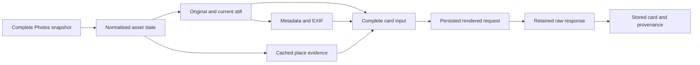

# Photos architecture

The Photos crawler owns read-only Apple Photos access, its source-native
archive, classification pipeline and query surface. `trawlkit` supplies shared
storage, control, output and model-call mechanics.

## Dependency graph

Classification is a resumable dependency graph rather than one sequential
loop:

Different assets may occupy different stages at once. Dependencies remain
strict within one asset: a classification call starts only after every required
upstream boundary is complete or explicitly proved absent.

## Source and asset state

The crawler reads a consistent snapshot of the configured Photos library. It
never changes Photos, albums, metadata, faces, media or iCloud state.

Only a proved-complete snapshot may establish that a previously current asset
is missing. The archive records the source state, the snapshot that established
it and any deletion time supplied by Photos. A missing asset is distinct from
an extractor, selection or network failure.

Deletion and restoration update source state and provenance. They do not by
themselves alter the classification input or spend another call. A valid card
remains readable and states that its source asset is no longer present.

If a complete snapshot first proves an asset missing before any card has been
stored, the archive permanently prohibits that asset's first paid card.
Restoration does not clear the prohibition. Metadata-only processing may run
once; stale or superseded card history means a later card is not the first.

## Image roles

Apple exposes two different image roles:

- `PHAssetResourceType.photo` supplies the camera original used for provenance
  and full metadata.
- [`PHImageManager.requestImageDataAndOrientation`](https://developer.apple.com/documentation/photos/phimagemanager/requestimagedataandorientation%28for%3Aoptions%3Aresulthandler%3A%29)
  with request version [`.current`](https://developer.apple.com/documentation/photos/phimagerequestoptionsversion/current)
  supplies the current rendered still, including edits, used for
  classification.

`PHAssetResourceType.fullSizePhoto` is a modified resource, not the canonical
selector for either role. An unedited asset may produce equivalent images, but
the pipeline proves byte identity instead of assuming it.

Resolved media uses a bounded local cache. Cache entries are tied to the source
version and verified by size and SHA-256 after restart. Partial exports never
become cache entries, and a file cannot be evicted while a request is reading
it.

## Metadata and place evidence

The private archive retains lossless metadata from the camera original. The
classification request receives a field-aware human projection with useful
dates, units and names. Unknown, malformed and contradictory values remain
explicit.

Place lookup is a configured product seam. It returns cached address, map
feature and point-of-interest evidence with source, relation, distance and
query provenance. Provider code returns candidates, not semantic truth: the
camera coordinate describes where the photographer stood, which may differ
from the place depicted.

An empty response does not silently become complete evidence. The stage records
whether the source proved an absence or whether acquisition failed.

## Classification boundary

The complete card input joins the selected current still with readable source,
metadata, album and place context. Before a remote call, the product persists
the exact rendered request, including the image role, media type, size, hash,
prompt identity and every truncation decision. It retains the exact raw
response before parsing.

Calls are authorised through immutable archive state with a fixed purpose,
ordered item set and cap. A committed claim is the authorisation point. If the
process stops after that commit but before retaining a response, the item stays
uncertain and is not sent again automatically.

Stage identity also binds the approval-receipt digest. Screening claims never
create or satisfy a stored-card generation. Canary and backfill claims bind to
the persisted request and attempt in the same archive transaction.

The response is one forced `submit_photo_card` tool call whose typed fields
contain prose. Deterministic parsing validates the exact schema but does not
decide whether semantic claims are true. A stored card contains a useful
summary, detailed visual description, important visible text and explicit
uncertainty.

## Provenance, restart and staleness

One private chain links the source snapshot and asset, original and classified
image hashes, metadata projection, place evidence, rendered request, raw
response, parser identity and stored card.

Every stage records enough input and output identity to reuse valid work after
restart. A stage distinguishes:

- verified source absence;
- unsupported source shape;
- transient failure;
- permanent failure with a safe reason; and
- complete output.

No partial output becomes complete state. When an input consumed by
classification changes, the active card becomes visibly stale and re-enters
the graph. A successful replacement supersedes rather than deletes the previous
card.

## Query and research boundaries

`search` projects stored source facts and cards. `open` presents readable
mechanical facts and the current card without exposing private evidence IDs.
Neither command performs a new semantic inference.

Research tooling may compare acquisition methods, evidence, prompts and models,
but it is not a second product pipeline. A research result applies to the
product only when it uses these same boundaries.
